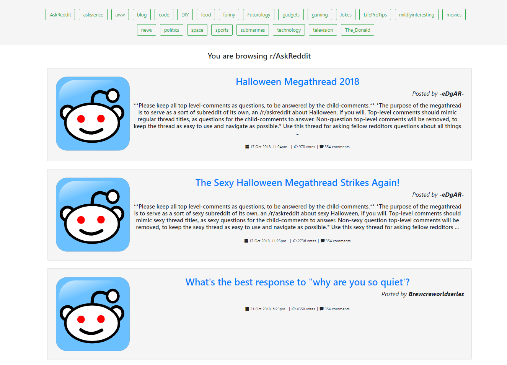

This project was bootstrapped with [Create React App](https://github.com/facebook/create-react-app).

Live demo:
https://reddit-client.000webhostapp.com/

How to run:
All you need to run this app is a recent version of node!

Step 1 ) Clone the repo.

Step 2) fetch all the dependencies by running `npm install` inside the project folder. 

Then start the app by running `npm start`. 

Features:
  - Read the latest 50 posts (includes stickys) from several Reddit subreddits.

  Missing features: 
  - Fetch all subreddits from API (will require redesign of the nav bar).
  - Read a post that has more than 500 characters, without redirecting to the original thread.
  - Display number of comments.
  - Read comments.
  - Display media in posts.
  - View authors (on reddit).

  Bugs:
  - Navigating back from Reddit, lands the user on the startup page 

Example:
